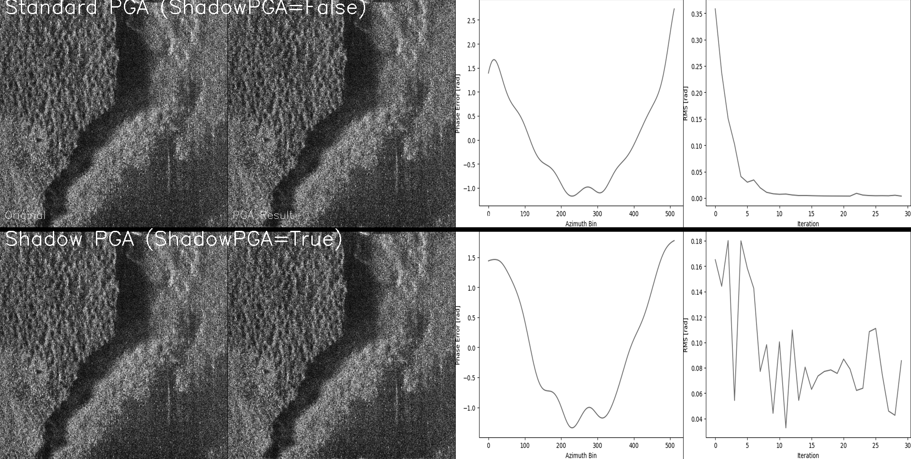

# PGA vs Shadow PGA Comparison Tools

This repository provides tools for comparing standard Phase Gradient Autofocus (PGA) with Shadow PGA for Synthetic Aperture Sonar (SAS) imagery. Shadow PGA, recently proposed by Prater et al. (2023), offers an alternative approach to traditional PGA by focusing on shadow regions rather than bright reflectors.

## Method Overview

The implementation builds upon the RITSAR Python toolbox's PGA algorithm, which uses the Maximum Likelihood (ML) kernel from Jakowatz & Wahl (1993):

> Jakowatz, Charles V., and Daniel E. Wahl. "Eigenvector method for maximum-likelihood estimation of phase errors in synthetic-aperture-radar imagery." *JOSA A* 10.12 (1993): 2539-2546.

The Shadow PGA extension follows the method described in:

> J. Prater, D. Bryner, and S. Synnes. "SHADOW BASED PHASE GRADIENT AUTOFOCUS FOR SYNTHETIC APERTURE SONAR." *5th annual Institute of Acoustics SAS/SAR Conference*. Lerici, Italy. 2023.

### Technical Insight
Sept 21, 2023 - I believe shadow PGA "works" because you are modeling the signal as -1 * direct delta function + DC offset. This is essentially the same model, mathematically speaking, as original PGA which models the signal as a dirac delta function. In both cases, convolving the PSF with either of these function behaves as such to characterize the PSF with the shadow PGA inducing a -1 multiplier in the result which is exactly what we see with shadow PGA. The signal model with shadow PGA can also be seen when you examine the incoherent integration of the signal after center shifting the min of each range bin. The resulting sum will look very similar, but with a -1 multiplier, to that when you incoherently sum the signal after center shifting the max of each range bin.

```
Standard PGA Model:                          Shadow PGA Model:
                                            
     ^                                           ^
     |                                           |
  1.0 +    δ(x)                              1.0 +------------  DC
     |     ▲                                     |      █
     |     █                                     |      █
     |     █                                     |      ▼
  0.0 +-----+-----+---> x                     0.0 +     
     |                                           |      
     |                                           |      
     |                                          -1.0 +---+----+--> x
                                                     -δ(x)

Convolution with PSF:                        Convolution with PSF:
     ^                                           ^
     |     PSF(x)                               |
     |      ╭─╮                                 |      
  1.0 +      │                               1.0 +------------  DC
     |       │                                   |  \   │   /
     |       │                                   |    \ │ /
     |       │                                   |      | 
  0.0 +    ╭─┼─╮                              0.0 +     |  
     |    ╱  │  ╲                               |    inverted 
     |   ╱   │   ╲                              |      PSF
     +---+---+---+--> x                    -1.0 +----+---+---+--> x
        -1   0   1                                  -1   0   1


After Integration:                          After Integration:
     ^                                          ^
     |      sum                                 |      
  1.0 +      ▲                              1.0 +------------  DC
     |       █                                  | \      █      /
     |       █                                  |   \    █    /
     |     ╱ █ ╲                                |     \  █  /
  0.0 +   ╱  █  ╲                            0.0 +       █   
     | ╱     █     ╲                            |        █   
     +-------+-------+--> x                -1.0 +--------+---------> x
        -1   0   1                                  -1   0   1
                                                        -sum
```

*Explanation:*
- Standard PGA models signal as δ(x) (delta function)
- Shadow PGA models as -δ(x) + DC offset
- After PSF convolution, Shadow PGA result is inverted but preserves phase information
- Integration shows similar profiles with -1 multiplier in Shadow PGA

## Example Results

Here are comparative examples showing how both methods perform on different types of scenes:

### Example 1: Rippled Seabed (Image 44)


*Comparison showing how standard PGA (top) and shadow PGA (bottom) handle rippled seabed features. Note the enhanced preservation of shadow regions in the Shadow PGA result.*

### Example 2: Mixed Terrain (Image 12)


*Performance comparison on mixed terrain, demonstrating the different focusing characteristics of each method. Each row shows: original image, autofocused result, phase error profile, and RMS convergence.*

## Performance Comparison

### Key Differences in Behavior

**Standard PGA:**
- Converges quickly (5-10 iterations) with smooth, monotonic RMS reduction
- Produces consistent phase corrections across different scene types
- Excels at focusing scenes with strong reflectors
- Generally achieves lower final RMS values

**Shadow PGA:**
- Takes more iterations (20-30) with oscillatory convergence
- Generates larger, more variable phase corrections
- Better preserves shadow region details
- Particularly effective on rippled seabed scenes

### Practical Considerations

Standard PGA is preferable for:
- Scenes dominated by bright reflectors
- Applications needing fast processing
- Cases requiring consistent overall focus

Shadow PGA shows advantages for:
- Scenes with significant shadow content
- Applications where shadow detail is crucial
- Rippled seabed imagery

## Usage

The comparison tool (`pga_shadow_pga_demo.py`) processes SAS images using both methods and generates side-by-side comparisons showing:
- Original and autofocused images
- Phase error profiles
- RMS convergence plots

### Requirements
- Python 3.x
- NumPy, SciPy
- OpenCV (cv2)
- Matplotlib
- PIL (Pillow)
- RITSAR
- GDAL

### Basic Usage
```python
# Example usage
import sas_tools

# Load and process a single SLC image
input_file = "path/to/your/test.npz"
output_dir = "processed_images"

# Run the demo script
python pga_shadow_pga_demo.py
```

## Future Research Directions

Potential areas for development include:
- Hybrid approaches combining both methods
- Adaptive selection between methods based on scene content
- Optimization of Shadow PGA convergence
- Scene-dependent parameter selection

## Acknowledgments
- Original RITSAR Python toolbox contributors
